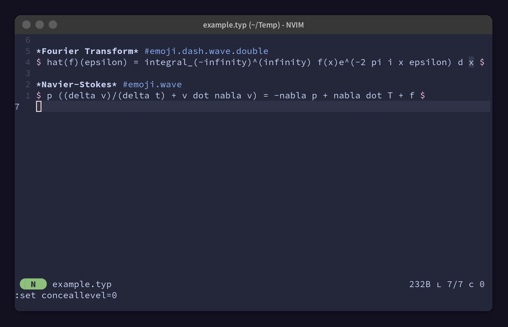

<div align="center">

# typst-conceal.vim

Vim Conceal for Typst

</div>

### Before


### After


### Output


## Installation

```vim
Plug 'MrPicklePinosaur/typst-conceal.vim', {'for': 'typst'}   " vim plug
Plugin 'MrPicklePinosaur/typst-conceal.vim'                   " vundle
```

Also ensure that conceal level is set
```vim
set conceallevel=2
```

## Configuration

It is possible to individually configure if math symbols and emoji are
concealed. By default all conceals are enabled by default.
```vim
let g:typst_conceal_math=1
let g:typst_conceal_emoji=1
```

## Credits

Based off of [tex-conceal.vim](https://github.com/KeitaNakamura/tex-conceal.vim)
